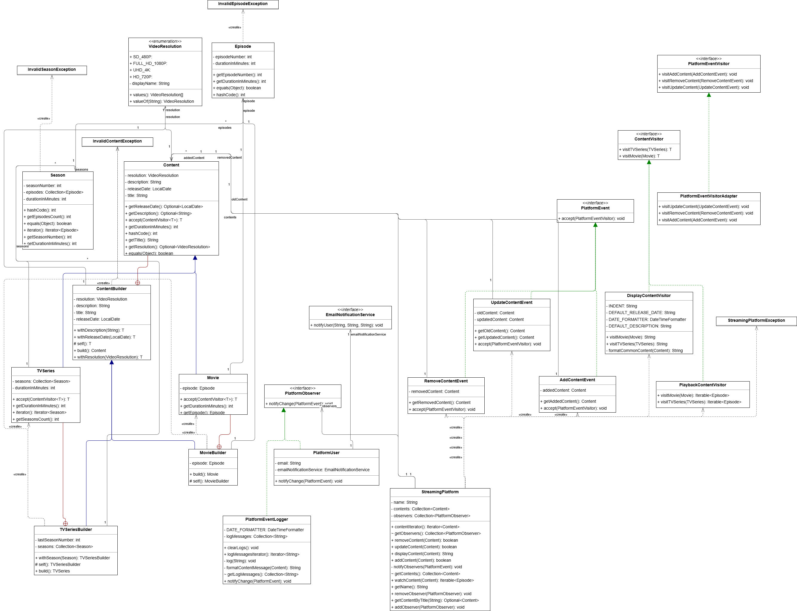

# Relazione Progetto: Free Media Platform

Studente: Lorenzo Yang

Matricola: 7136074

Corso: Metodologie di Programmazione

## Descrizione delle funzionalità del sistema implementato

Il progetto consiste nella simulazione di una piattaforma gratuita di streaming multimediale che consente agli utenti di visualizzare e guardare contenuti multimediali. Per semplificare il modello e mantenere la coerenza con la sua natura gratuita, non sono state implementate funzionalità come registrazione e login: i contenuti sono accessibili liberamente, senza autenticazione. I componenti principali del sistema sono:

- `Content`: rappresenta i contenuti multimediali disponibili sulla piattaforma, suddivisi in:
  - `Movie`: un film, concettualmente composto da un unico `Episode`. Inizialmente avevo pensato di aggiungere anche una classe `Video` che rappresentava il file multimediale del video stesso, ma ho poi evitato questo ulteriore livello di astrazione in quanto non strettamente rilevante per gli obiettivi del corso. Come nella realtà, i film non prevedono stagioni, quindi il concetto di stagione è stato omesso.
  - `TVSeries`: una serie TV strutturata in più `Season`, ognuna contenente diversi `Episode`. Anche qui inizialmente avevo pensato di realizzare il concetto di `Season` con una semplice lista di `Episode`, ma considerando che una serie TV può avere anche più stagioni, e l'uso di liste di `Episode` rendeva meno leggibile e chiaro il codice (violando anche i principi di design), ho quindi deciso di implementare il concetto di `Season` come una classe separata.
  - **Criteri di uguaglianza tra contenuti:** nel contesto di questo progetto, **due contenuti sono considerati uguali se hanno lo stesso titolo, indipendentemente dal fatto che siano film o serie TV.** Questa scelta implica che un film e una serie TV con lo stesso titolo siano considerati equivalenti. Di conseguenza, il controllo sulla classe (`getClass()`) è stato omesso nell'implementazione del metodo `equals` ma il vincolo che entrambi gli oggetti debbano essere sottoclassi di `Content` rimane.
- `PlatformUser`: rappresenta un utente della piattaforma. Inizialmente, erano state previste funzionalità complesse come la gestione di preferiti e cronologia. Tuttavia, il progetto si è evoluto verso un modello più semplice in cui l'utente assume il ruolo di osservatore del sistema. Solo gli utenti che si registrano (fornendo un'email) ricevono notifiche in caso di aggiunta o aggiornamento dei contenuti. L'email, una volta registrata, non è modificabile; per cambiarla, è necessario rimuovere il vecchio utente e registrarne uno nuovo.
- `StreamingPlatform`: rappresenta la piattaforma stessa, che gestisce contenuti e utenti (registrati come osservatori). È il componente principale che coordina l’interazione tra contenuti, utenti e funzionalità offerte. Di seguito chiarisco meglio alcune funzionalità principali della piattaforma:
  - **Funzionalità di aggiornamento dei contenuti (`updateContent`):** trova il contenuto da aggiornare (secondo i criteri di uguaglianza definiti) e lo aggiorna (sostituisce) con il nuovo contenuto fornito (deve avere quindi lo stesso titolo). Come conseguenza, posso quindi aggiornare un film con una serie TV o viceversa, ma il titolo deve essere lo stesso.
  - **Funzionalità di visione dei contenuti (`watchContent`):** simula la visione di un contenuto, restituendo una lista ordinata di episodi. Per un `Movie`, la lista conterrà un singolo episodio; per una `TVSeries`, gli episodi saranno ordinati per numero di stagione e numero di episodio.

## Design pattern applicati

- Builder
- Visitor
- Observer
- Adapter (versione "degenere")

## Scelte di design e dettagli implementativi

### Builder

Per la creazione degli oggetti `Content` (`Movie` e `TVSeries`), che sono complessi e con diversi campi opzionali, ho utilizzato il pattern Builder (basato su fluent interface). L'intento di questo pattern è di separare la costruzione di un oggetto complesso dalla sua rappresentazione. Ho creato anche una superclasse astratta `ContentBuilder` per evitare la duplicazione del codice nei builder specifici (`MovieBuilder` e `TVSeriesBuilder`): poiché `Movie` e `TVSeries` derivano dalla stessa superclasse `Content`, hanno diversi campi in comune come `title`, `description`, ..., senza un Builder in comune avrei dovuto riscrivere gli stessi metodi in entrambi i builder, per i campi in comune, come `withDescription`, `withReleaseDate`, `withResolution`, ecc.

```java
// ContentBuilder
public ContentBuilder withDescription(String description) { 
  // ...
  return this;
}
```
Tuttavia, questo approccio non risolve del tutto la duplicazione, perché sono comunque costretto a riscrivere i metodi ereditati per modificare il tipo di ritorno. Infatti, per esempio se `withDescription` restituisce un `ContentBuilder`, non posso concatenare metodi specifici di `TVSeriesBuilder` come `withSeason`. Riscrivere i metodi solo per adeguare il tipo di ritorno rende inefficace o poco utile l’uso di una superclasse. Per ovviare a questo, ho utilizzato il generic di Java, definendo la superclasse come segue:

```java
ContentBuilder<T>
// e per restringere ulteriormente la 'T'
// in questo modo nel nostro caso la T può essere solamente MovieBuilder o TVSeriesBuilder
// cioè qualsiasi tipo T che sia una sottoclasse di ContentBuilder di tipo T
ContentBuilder<T extends ContentBuilder<T>>
```
Con questa soluzione, però, non è possibile restituire direttamente `this`, perché il compilatore riconosce `this` solo come un `ContentBuilder<T>` e non come il tipo specifico `T` (che può essere `MovieBuilder` o `TVSeriesBuilder`). Per risolvere, ho introdotto un metodo astratto `self()` con tipo di ritorno `T`, che viene implementato nelle sottoclassi e restituito al posto di `this`, garantendo così la corretta inferenza del tipo da parte del compilatore (il tipo che restituisce `self()` e quello dichiarato nei metodi del `ContentBuilder` combaciano): dove il tipo di ritorno `T` è richiesto invece di restituire `this`, restituisco `self()` quuest'ultimo ha proprio il tipo di ritorno corretto cioè la `T`, al runtime le sottto classi concrete di `ContentBuilder` (come `MovieBuilder` e `TVSeriesBuilder`) implementano questo metodo `self()` restituendo il proprio `this`. 

Nel costruttore di `Content`, che riceve un `ContentBuilder` come parametro, il tipo generico `T` non è rilevante, poiché l'unica operazione è l'assegnazione di campi. L'uso di una wildcard (?) chiarisce questa intenzione:
```java
protected Content(ContentBuilder<?> builder) {
    // Assegnazione dei campi
}

// oppure:
// ma la 'T' in questo caso non mi serve
protected <T extends ContentBuilder<T>> Content(ContentBuilder<T> builder) {
    // Assegnazione dei campi      
}
``` 

I builder specifici (`MovieBuilder` e `TVSeriesBuilder`) includono numerosi controlli di validazione. Grazie al pattern Builder, tali verifiche avvengono durante la fase di configurazione e vengono finalizzate dal metodo `build()`, assicurando che l'oggetto creato sia sempre in uno stato valido. Per mantenere questa garanzia nel tempo, tutte le classi del modello (`Movie`, `TVSeries`, `Season`, `Episode`) sono state progettate come immutabili.

**Testing:** le classi astratte `Content` e `ContentBuilder` sono state testate attraverso le loro implementazioni concrete. La logica di costruzione è stata validata all'interno dei test di `Movie` e `TVSeries`, poiché i builder sono implementati come inner class strettamente accoppiate al loro "prodotto". Sebbene questo approccio comporti una minima duplicazione nei test per i metodi ereditati da `ContentBuilder`, rende i singoli test più chiari e autoconsistenti. Data la numerosità dei controlli, per i test di costruzione è stata prima verificata la "situazione felice" (costruzione corretta) e poi quelle in cui si dovrebbe verificare un errore.

### Visitor

Il pattern Visitor è stato applicato in due contesti distinti per aggiungere nuove operazioni a gerarchie di classi esistenti senza modificarle, rispettando i principi Open-Closed (OCP) e Single Responsibility (SRP).

La gerarchia `Content` potrebbe aver bisogno, in futuro, di nuove funzionalità, come ad esempio esportare i contenuti in diversi formati oppure calcolare delle statistiche. Aggiungere questi metodi direttamente dentro le classi `Movie` e `TVSeries` non sarebbe una buona scelta, perché renderebbe il codice più complicato e meno leggibile. Inoltre, ogni volta che servirebbe una nuova funzionalità, dovrei andare a modificare le classi già esistenti, cosa che si cerca di evitare. Usando il pattern Visitor, invece, posso aggiungere nuove operazioni senza toccare le classi della gerarchia `Content`.

Anche nella gerarchia degli eventi (`PlatformEvent`, `AddContentEvent`, `UpdateContentEvent`, `RemoveContentEvent`) ho utilizzato il Visitor, ma nel contesto del pattern Observer. Serve perché gli osservatori devono reagire in modo diverso a seconda del tipo di evento ricevuto. Per esempio, un `AddContentEvent` contiene solo il nuovo contenuto da aggiungere, mentre un `UpdateContentEvent` contiene sia la versione vecchia che quella aggiornata del contenuto.

**Testing:** per la gerarchia `Content`, ogni implementazione concreta del Visitor (es. `DisplayContentVisitor`) è stata testata in un file dedicato, i contenuti multimediali creati per testare i Visitor concreti, sono sempre stati trattati tramite il loro tipo base `Content` (sfruttando il double-dispatch con due volte di binding dinamico). Per la gerarchia degli eventi, i visitor concreti sono stati implementati come classi anonime e testati indirettamente all'interno dei test degli osservatori (`PlatformUserTest` e `PlatformEventLoggerTest`).

### Observer

Per gestire le notifiche relative ai cambiamenti sulla piattaforma, ho implementato il pattern Observer. Questo pattern consente agli osservatori (utenti registrati, logger) di essere informati automaticamente di eventi significativi (aggiunta, aggiornamento, rimozione di contenuti) senza dover interrogare attivamente lo stato della piattaforma (polling). Dato che il sistema prevede un unico tipo di soggetto concreto non ho implementato un AbstractSubject, la gestione degli osservatori è stata implementata direttamente all'interno di `StreamingPlatform`.

**Testing:** La logica di gestione degli osservatori è stata testata in `StreamingPlatformTest`, utilizzando un mock di `PlatformObserver` creato tramite lambda expression. Gli osservatori concreti (`PlatformUser` e `PlatformEventLogger`) sono stati testati in file separati, interagendo con un'istanza reale di `StreamingPlatform` che fungeva da soggetto. Per `PlatformUser`, è stato necessario creare un mock del servizio email per verificare il corretto invio delle notifiche.


### Adapter

Nell'implementazione dell'Observer, ho notato che alcuni osservatori non sono interessati a tutti i tipi di evento. Ad esempio, PlatformUser reagisce solo all'aggiunta e all'aggiornamento dei contenuti. Per evitare di implementare metodi vuoti, ho utilizzato la variante "degenere" del pattern Adapter che fornisce un'implementazione di default. Invece di implementare direttamente l'interfaccia `PlatformEventVisitor`, gli osservatori estendono `PlatformEventVisitorAdapter`, una classe astratta che fornisce un'implementazione di default per tutti i metodi visit.... In questo modo, `PlatformUser` può sovrascrivere solo i metodi di suo interesse (`visitAddContent` e `visitUpdateContent`). Questa soluzione offre maggiore flessibilità rispetto ai default method di Java 8, consentendo ai client di scegliere se gestire tutti gli eventi (implementando l'interfaccia) o solo un sottoinsieme (estendendo l'adapter).

**Testing:** la classe `PlatformEventVisitorAdapter`, essendo astratta, è stata testata indirettamente attraverso i test dei suoi client, come `PlatformUser`. Il test `testNotifyChangeForRemoveContentEvent` in `PlatformUserTest`, ad esempio, verifica che l'implementazione di default venga correttamente invocata (non producendo alcun effetto).


### Descrizione dei partecipanti dei pattern

#### Builder

- `ContentBuilder`: la classe astratta che definisce i metodi comuni per costruire un contenuto (`Content`) (film o serie TV) 
- `MovieBuilder`: la classe concreta che estende `ContentBuilder` per costruire oggetti oggetti della classe `Movie`
- `TVSeriesBuilder`: la classe concreta che estende `ContentBuilder` per costruire oggetti della classe `TVSeries`

#### Visitor

- per la gerarchia `Content`:
  - `Content`: la classe astratta che rappresenta i contenuti multimediali (un'interfaccia per gli elementi visitabili), contiene il metodo astratto `accept` per accettare un visitor
    - `Movie`: la classe concreta (il 'contenuto' concreto) che rappresenta un film
    - `TVSeries`: la classe concreta (il 'contenuto' concreto) che rappresenta una serie TV
  - `ContentVisitor`: l'interfaccia che definisce i metodi per visitare i contenuti
  - `DisplayContentVisitor`: l'implementazione concreta del visitor per implementare la visualizzazione dei contenuti
  - `PlaybackContentVisitor`: l'implementazione concreta del visitor per implementare la visione dei contenuti (simulazione della visione)
- per la gerarchia degli eventi:
  - `PlatformEvent`: l'interfaccia che rappresenta un evento della piattaforma, contiene il metodo `accept` per accettare un visitor
    - `AddContentEvent`: la classe concreta (l'evento concreto) che rappresenta l'aggiunta di un nuovo contenuto
    - `UpdateContentEvent`: la classe concreta (l'evento concreto) che rappresenta l'aggiornamento di un contenuto esistente
    - `RemoveContentEvent`: la classe concreta (l'evento concreto) che rappresenta la rimozione di un contenuto
  - `PlatformEventVisitor`: l'interfaccia che definisce i metodi per visitare gli eventi della piattaforma
  - Un'istanza della classe anonima che estende `PlatformEventVisitorAdapter` (nel caso di `PlatformUser`)
  - Un'istanza della classe anonima che implementa `PlatformEventVisitor` (nel caso di `PlatformEventLogger`)

#### Observer

- `StreamingPlatform`: la classe concreta che funge da soggetto osservabile, gestisce gli osservatori e notifica gli eventi
- `PlatformObserver`: l'interfaccia che definisce i metodi per ricevere notifiche sugli eventi della piattaforma, l'interfaccia che gli osservatori devono implementare.
- `PlatformEventLogger`: l'osservatore concreto che registra gli eventi della piattaforma (compie operazioni di logging)
- `PlatformUser`: l'osservatore concreto che riceve notifiche sugli eventi della piattaforma e agisce di conseguenza (in questo caso, notifica gli utenti nel mondo reale tramite servizi email)

#### Adapter

L'implementazione segue una variante "degenere" del pattern, il cui scopo non è adattare interfacce incompatibili, ma semplificare l'uso di un'interfaccia con molti metodi. I partecipanti possono essere interpretati come segue:
- `PlatformEventVisitor`: è l'interfaccia che il Client desidera utilizzare, ma che risulta scomoda da implementare interamente (target)
- `PlatformEventVisitorAdapter`: è la classe astratta (adattatore) che implementa l'interfaccia `PlatformEventVisitor` fornendo un'implementazione vuota per tutti i suoi metodi. Il Client estende questa classe per ereditare le implementazioni di default, sovrascrivendo solo quelle di suo interesse
- Le classi come `PlatformUser` e `PlatformEventLogger` in questo caso sono i Client che desiderano utilizzare l'interfaccia `PlatformEventVisitor`

### UML

